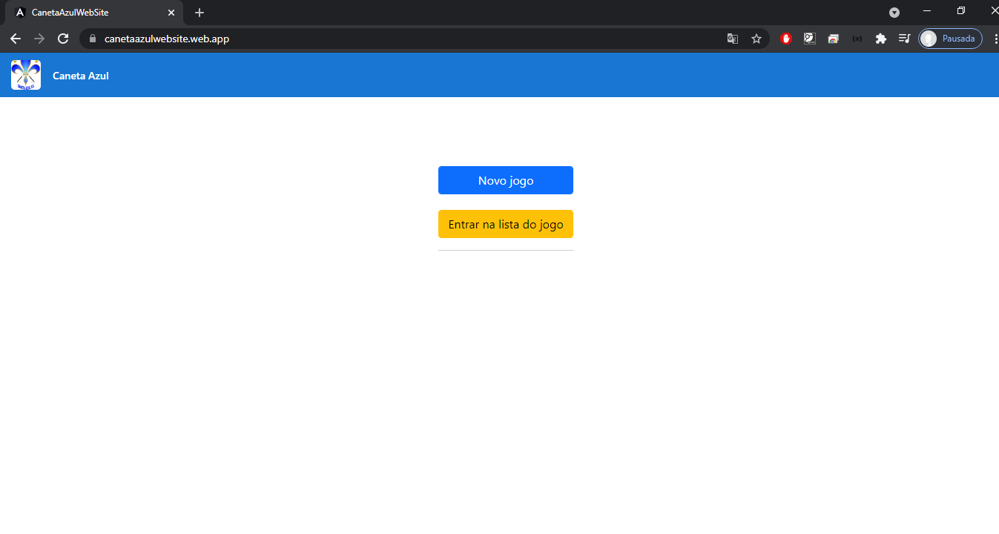
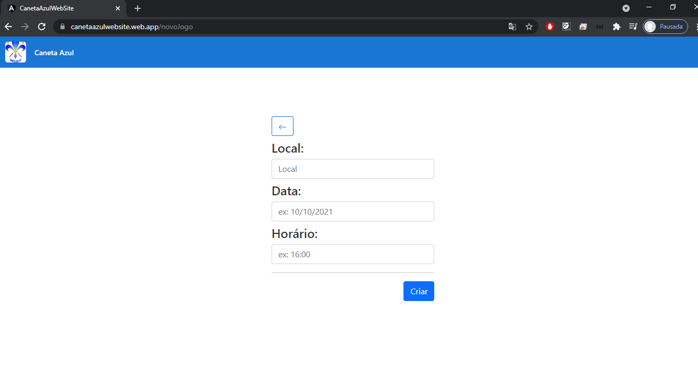
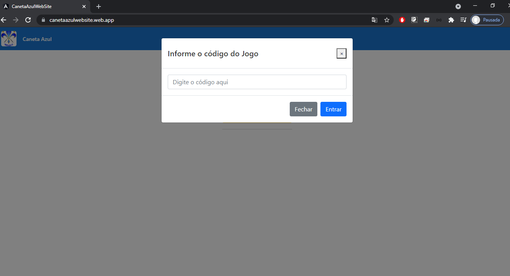
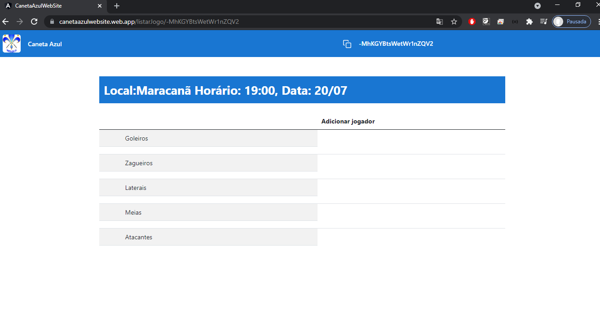
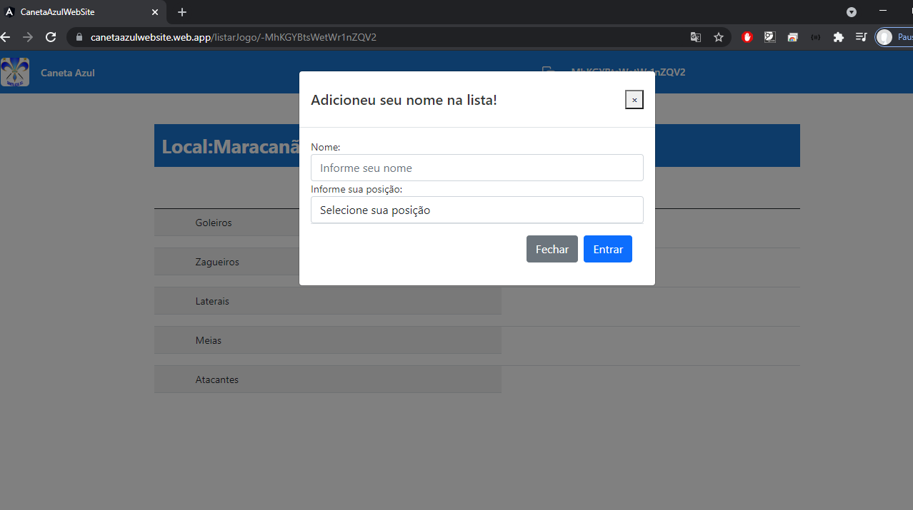

<h1>Caneta Azul Web Site</h1>

### Aplicação desenvolvida para facilitar a organização de amistosos de um time de amigos.

## Tecnologias Utilizadas
* Angular
* Bootstrap  
* Firebase 

## Iniciar o projeto
* Clone o Repositório
* Execute o npm install
* Execute o ng-serve

## Telas

### Tela Inicial

### Tela Novo Jogo

### Tela Entrar em um Jogo

### Tela Principal

### Tela Adicionar nome na lista

### Aplicação Publicada
<label>Link: <a href="https://canetaazulwebsite.web.app/" target="_blank">Canteta Azul Web Site</a></label>